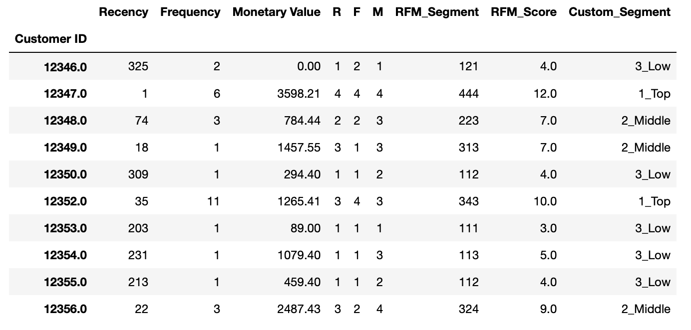
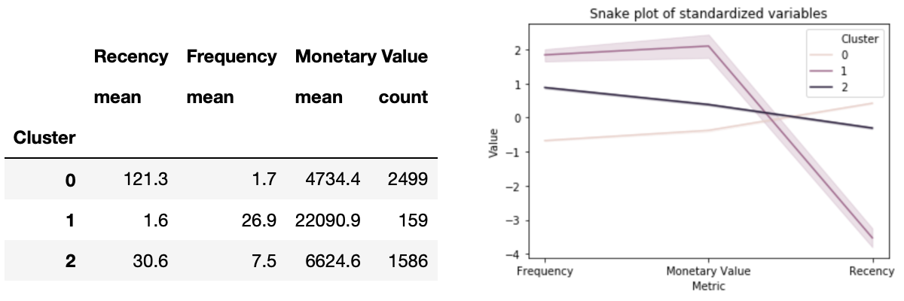

# RFM Analysis

Recency, Frequency and Monetary Value segmentation of customers.

## Installation
- Python 3.7.3
- Data: [Online Retail II Data Set, UCI Machine Learning Repository](http://archive.ics.uci.edu/ml/datasets/Online+Retail+II)
- Libraries: pandas, NumPy, Matplotlib, Seaborn

## File Descriptions
Because the dataset is large and publicly available, I did not upload it here. 

The analysis can be found in two parts as Jupyter Notebooks here:

* [RFM_analysis.ipynb](https://github.com/k-bosko/RFM_analysis/blob/master/RFM_analysis.ipynb)
* [RFM_customer_segmentation_with_kmeans.ipynb](https://github.com/k-bosko/RFM_analysis/blob/master/RFM_customer_segmentation_with_kmeans.ipynb)

## Project Description
In this project, I analyzed customer behavior for online retail store that sells unique all-occasion gift-ware in the UK. 

The dataset consists of 1,067,371 transactions and has the following variables:

| Variable | Description |
| :--- | :--- |
| **InvoiceNo** | Invoice number. Nominal. A 6-digit integral number uniquely assigned to each transaction. If this code starts with the letter 'c', it indicates a cancellation.|
| **StockCode** | Product (item) code. Nominal. A 5-digit integral number uniquely assigned to each distinct product.  
| **Description** | Product (item) name. Nominal.|
| **Quantity** | The quantities of each product (item) per transaction. Numeric.|
| **InvoiceDate** | Invice date and time. Numeric. The day and time when a transaction was generated. |
| **UnitPrice** | Unit price. Numeric. Product price per unit in sterling. |
| **CustomerID** | Customer number. Nominal. A 5-digit integral number uniquely assigned to each customer.|
| **Country** | Country name. Nominal. The name of the country where a customer resides.|

I created RFM segments for 2011 year, calculated **RFM Score** for each customer and segmented into 3 custom segments 'Top', 'Middle' and 'Low' based on the total RFM Score.
In the next step, I segmented the RFM data with **k-means clustering** technique and visualized the results as a snake plot and a heatmap.

## Results

It seems like there are 159 customers (probably wholesalers) in Cluster 1 who buy a lot from us pretty frequent. These are our core business clients.  
The snake plot shows the distinction between 3 Clusters - there is Cluster 1 with customers that spend the most, buy most frequently and most recently. The next good segment is Cluster 2 (1586 customers) with average spending of 6624.6 sterling in 2011, 7.5 transactions and about a month since the last purchase. The least attractive is Cluster 0 (2499) - with about 4 months since last transaction on average, almost 2 transactions per year and no more than 5000 sterling in yearly purchases.

