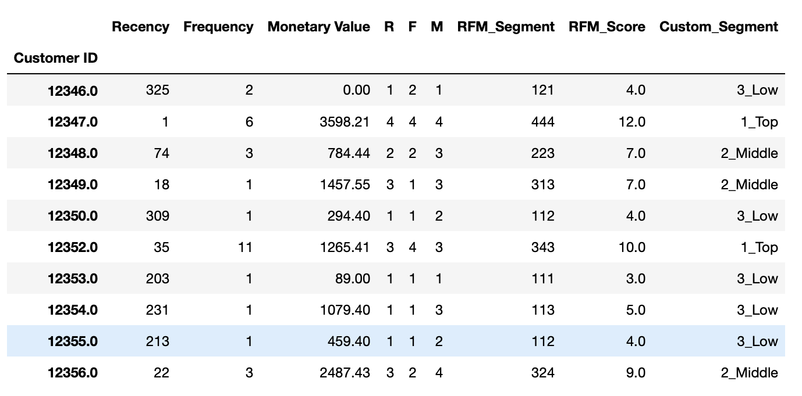

# RFM Analysis

Recency, Frequency and Monetary Value segmentation of customers.

## Installation
- Python 3.7.3
- Data: [Online Retail II Data Set, UCI Machine Learning Repository](http://archive.ics.uci.edu/ml/datasets/Online+Retail+II)
- Libraries: pandas, NumPy, Matplotlib, Seaborn

## File Descriptions
Because the dataset is large and publicly available, I did not upload it here. 

The analysis can be found as Jupyter Notebook here:

* [RFM_analysis.ipynb](https://github.com/k-bosko/RFM_analysis/blob/master/RFM_analysis.ipynb)

## Project Description
In this project, I analyzed customer behavior for online retail store that sells unique all-occasion gift-ware in the UK. 

The dataset consists of 1,067,371 transactions and has the following variables:

**InvoiceNo**: Invoice number. Nominal. A 6-digit integral number uniquely assigned to each transaction. If this code starts with the letter 'c', it indicates a cancellation.  
**StockCode**: Product (item) code. Nominal. A 5-digit integral number uniquely assigned to each distinct product.  
**Description**: Product (item) name. Nominal.  
**Quantity**: The quantities of each product (item) per transaction. Numeric.  
**InvoiceDate**: Invice date and time. Numeric. The day and time when a transaction was generated.  
**UnitPrice**: Unit price. Numeric. Product price per unit in sterling.  
**CustomerID**: Customer number. Nominal. A 5-digit integral number uniquely assigned to each customer.  
**Country**: Country name. Nominal. The name of the country where a customer resides.  

I created RFM segments for 2011 year, calculated RFM Score for each customer and segmented into 3 custom segments 'Top', 'Middle' and 'Low' based on the total RFM Score.

## Results

